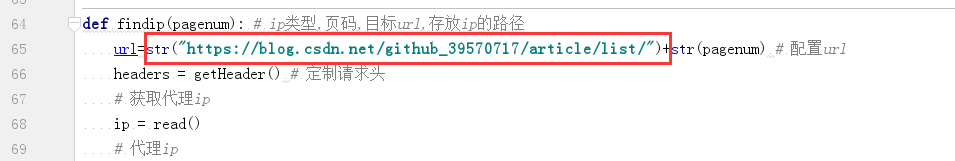
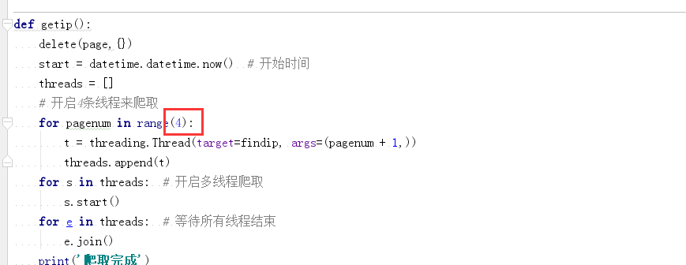
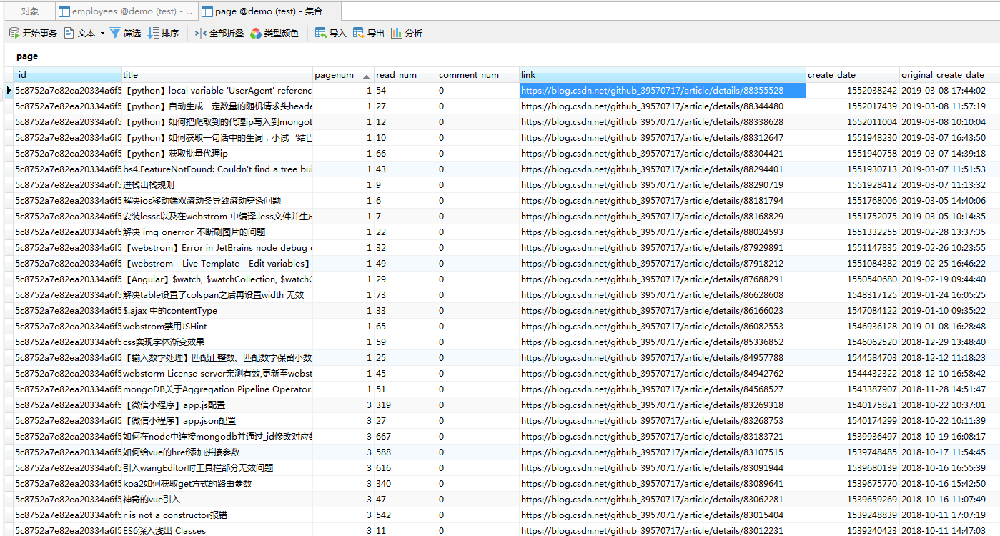

# python-spider

### 目录结构
* **getIp.py** 获取代理ip
* **csdn-test.py** 获取‘我’在csdn的博文资料

### 开始
1.鼠标右键直接run  

### 爬取csdn
1. 先运行getIp.py 获取一定量的代理ip并存入数据库  

2. 再打开csdn-test.py

3. 修改博文地址为自己的地址

4. 此处录入博文的页数

5. 运行csdn-test.py

#### 效果如下：

