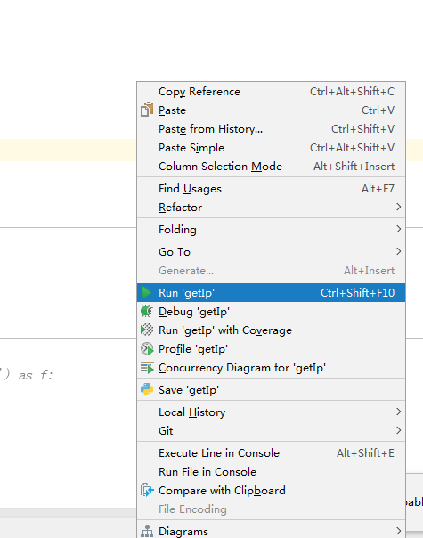
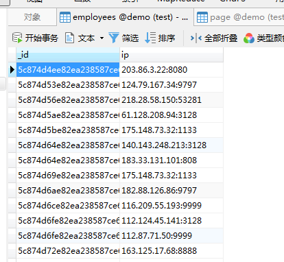

# python-spider

### 目录结构
* **__iniit__.py** 引入的文件
* **csdn-test.py** 获取‘我’在csdn的博文资料

* ./module** 模块文件

#### 一.开始
1.鼠标右键直接run  

#### 二.爬取csdn

1. 打开csdn-test.py

2. 修改博文地址为自己的地址

3. 运行csdn-test.py

3. 程序会先爬取一定量的代理ip并存入数据库，再执行爬取内容的操作，若遇到博文内容为空，则另外再爬取博文

#### 三.效果如下：

